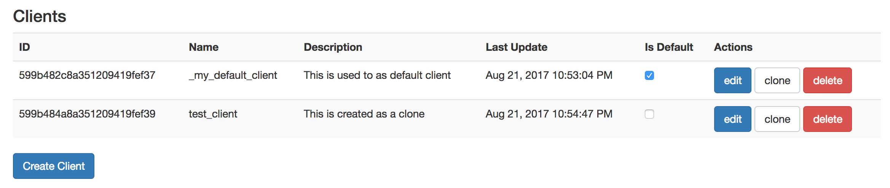

==== Admin UI

Smarti includes a User Interface to maintain clients and configurations.

  http://${smarti-host}:${smarti-port}/

===== Client Overview

The client overview shows all existing clients with its actions.
With *Is Default* you can mark a default client which is used as a copy base if a new client is created by issuing a message.
With *Create Client* you can create an empty client, which *clone* you can use any existing client as a copy base.

===== Client Single View

image::../images/single_client.png[Single Client View]

The single view of a client enables you to edit basic data and to add, remove an edit query builders.
