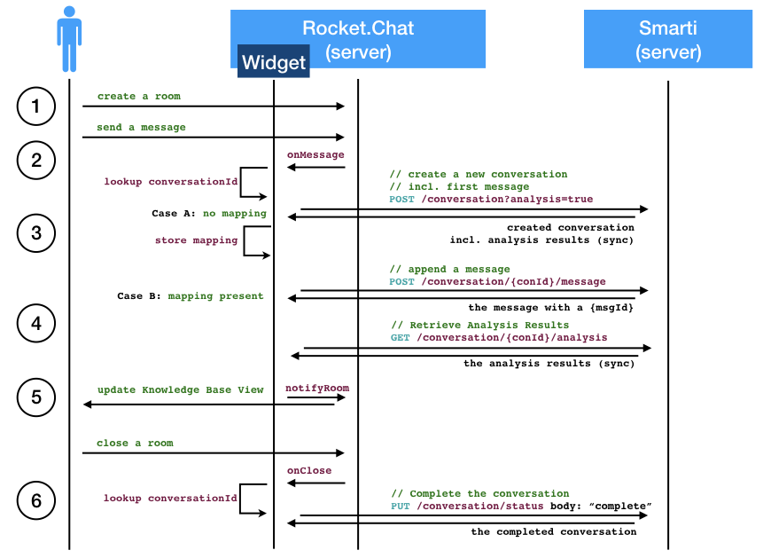

=== Legacy Webservice

Smarti version up tp `v0.6.*` where managing the mapping of channel/room IDs to conversation. From `v0.7.0` onwards those mappings need to be managed by the integrator.

This change comes with the requirement that Smarti `v0.6.*` users that migrate to `v0.7.0` do have a possibility to lookup conversation IDs for channel/rooms that where processed before the migration.

For this case the Legacy Webservice provide such a lookup:

```
GET /legacy/rocket.chat?channel_id={channel-id}
```

A call to this service will return the `Conversation` for the parsed `channel-id` or `404 Not Found` if the channel is not known by Smarti

NOTE: The service is intended for an initial lookup. Integrators SHOULD store `cannel-id` to `conversation-id` mappings after the initial lookup.

=== Integrations

==== Rocket.Chat

For now Smarti is working with https://rocket.chat[Rocket.Chat] conversations, where it can be smoothly integrated via a https://github.com/assistify/Rocket.Chat[RC plugin].

  http://${smarti-host}:${smarti-port}/plugin/v1/rocket.chat.js

NOTE: Up until version `v0.6.*` the integration with rocket chat was implemented by the Rocket-Chat Endpoint - a wervserivce provided by Smarti. This web service was removed with `v0.7.0` and replaced by the Smarti-Widget code directly working with the conversation webservice.


[NOTE]
====
*TODO*

The Rocket.Chat Plugin consists of three parts:

1. The Rocket.Chat integration code
2. The Smarti backend adapter
3. The Smarti frontend plugin
====

=== Rocket.Chat Integration Sequence


1. The integration does not react on the creation of a chat room
2. When sending a message the widget is notified by the `onMessage` method. At that points its checks if a Smarti Conversation is already present for the room of the message.
3. **Case A:** If no Conversation is present the widget creates a new Smarti Conversation. To save additional requests it (a) includes the current message when creating the conversation and (b) it sets `analysis=true` so that Smarti includes the analysis results in the response
4. **Case B:** If a Conversation is mapped to the room of the current message the message is appended to the conversation and the analysis for the updated conversation is requested
5. As soon as the Analysis is available the `notifyRoom` is called. This will update the Knowledge Base View.
6. If the users closes a room the `onClose` method of the widget sets the status of the Smarti Conversation to `complete`