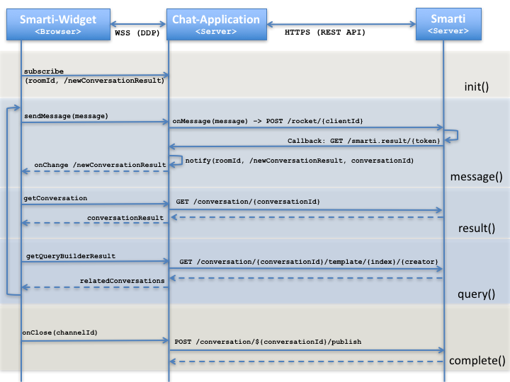

=== Chat adapter web service

For now Smarti is working with https://rocket.chat[Rocket.Chat] conversations, where it can be smoothly integrated via a https://github.com/assistify/Rocket.Chat[RC plugin].

  http://${smarti-host}:${smarti-port}/plugin/v1/rocket.chat.js

[NOTE]
====
*TODO*

The Rocket.Chat Plugin consists of three parts:

1. The Rocket.Chat integration code
2. The Smarti backend adapter
3. The Smarti frontend plugin
====

=== Rocket.Chat Integration Sequence

